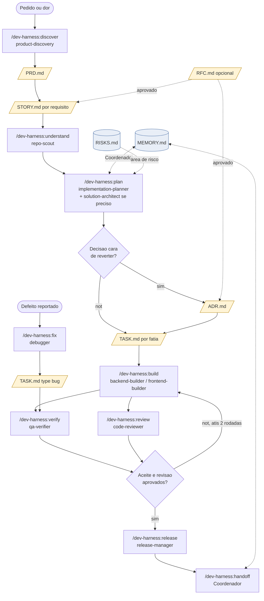
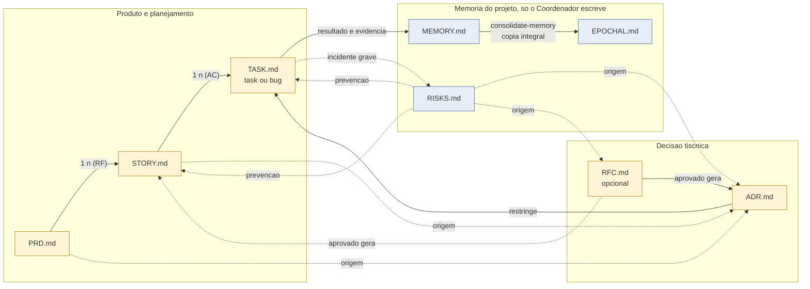

# When to use each template
Versão em pt-br: [docs/tutoriais/templates.md](../../tutoriais/templates.md)

The templates live in `templates/pt-br/` e `templates/en/` no kit, in mirrored versions; o `setup` grava `language` em `.harness/project.yaml` and selects the folder. In the consumer project, each one lives in `.harness/`, filled from the copy. This guide explains which one to use, who writes it, and when to open and close it.

## Summary

| Template | Responde | Who writes | Open when | Close when |
|---|---|---|---|---|
| `PRD.md` | Why and what (produto) | Owner do produto, com `product-discovery` | Uma dor ou oportunidade ainda not tem escopo e aceite claros | Requisitos e aceite aprovados; stories derivadas |
| `STORY.md` | Which end-to-end behavior | `product-discovery` ou `implementation-planner` | Um requisito do PRD precisa virar algo testavel | Todos os AC tem evidencia de passed |
| `TASK.md` (task) | How to execute a slice | `implementation-planner`; executado pelo builder | A story foi decomposta em fatias verificaveis | Checks passesram, revisao feita, resultado preenchido |
| `TASK.md` (bug) | O que fails e por que | `debugger` | Um defeito foi reportado ou observado | Reproducao antes/depois e regressao registradas, ou status inconclusivo com lacuna declarada |
| `ADR.md` | Which durable decision was made and why | `solution-architect`, aprovado pelo owner | Uma escolha cara de reverter precisa de registro | Status `aceito`; revisado quando a condicao de revisao ocorrer |
| `RFC.md` (opcional) | Qual mudanca tiscnica se propoe, antes de construir | Engenharia | Mudanca ampla sem PRD, com impacto alism do autor | Aprovado (gera ADR e stories), rejeitado ou retirado |
| `MEMORY.md` | Current execution state | Coordinator only | Na inicializacao do projeto (`setup`) | Never closes; is enxugado por `consolidate-memory` |
| `EPOCHAL.md` | Raw history of previous memories | Coordinator only | No primeiro `consolidate-memory` | Never closes; so recebe lotes |
| `RISKS.md` | Serious incidents and prevention | Coordinator only | Na inicializacao do projeto | Never closes; incidentes resolvidos permanecem |

## Rules that apply to all

- Facts, hypotheses, and decisions are marked as such.
- Paths are relative to the project. No secrets, tokens, or personal paths.
- Cada critisrio de aceite is "quando X, entao Y" e aponta o cenario ou teste que o prova.
- Evidencia so existe com estado explicito: passed, failed ou not executado. Typecheck not prova comportamento.
- HTML comments in templates are filling guidance and are removed from the final file.
- Os tres registros de memoria sao escritos apenas pelo Coordenador. Os demais papisis reportam.

## How to choose

**Comeca por uma dor de user ou de negocio?** PRD. Se o escopo ja is claro e cabe em uma story, pule o PRD e abra a story apontando a origem.

**Is it a deliverable, testable behavior?** Story. Se not cabe em poucas tasks, divida antes de planejar.

**Is it a slice of work for an agent to execute?** Task. Se is um defeito, o mesmo arquivo com a secao de bug preenchida.

**E uma escolha tiscnica cara de reverter?** ADR. Inclua sempre a opcao "manter como esta" e a condicao de revisao.

**E uma mudanca tiscnica ampla sem PRD e com impacto alism do autor?** RFC, se quiser discussao formal antes. Em desenvolvimento solo com agentes, um ADR com status `proposto` costuma bastar; o RFC is opcional.

**Is it state, history, or an incident?** None of the above. Report it to the Coordinator, who writes in `MEMORY.md`, `EPOCHAL.md` ou `RISKS.md`.

## Engineering flow

Exemplo com os comandos do kit. Nem toda tarefa passes por todas as etapas: a bug goes directly into `fix`; a small edit goes directly into `build` com uma task.



## Relationship between files



Leitura das setas: linha cheia is derivacao ou escrita; linha pontilhada is referencia ou consulta. Os cardinais indicam que um PRD gera varias stories (uma por requisito) e uma story gera varias tasks (cobrindo seus critisrios de aceite).

## Suggested locations in the consumer project

```
.harness/
  project.yaml        perfil do projeto (setup)
  MEMORY.md           EPOCHAL.md          RISKS.md
  prd/PRD-001.md
  stories/ST-001.md
  adr/ADR-001.md
  rfc/RFC-001.md      (opcional)
  tasks/T-001/TASK.md
  tasks/BUG-001/TASK.md
```

Only `.harness/tasks/<id>/` e os tres registros de memoria are defined by the product plan. The other directories are suggested conventions and may change in the project profile.
