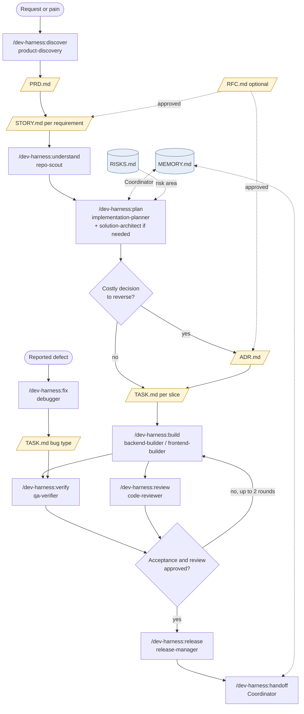
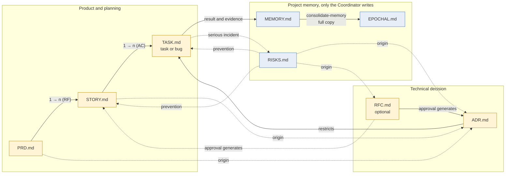

# When to use each template
Versão em pt-br: [docs/tutoriais/templates.md](../../tutoriais/templates.md)

The templates live in `templates/pt-br/` and `templates/en/` in the kit, in mirrored versions; `setup` records `language` in `.harness/project.yaml` and selects the folder. In the consumer project, each one lives in `.harness/`, populated from the copy. This guide explains which one to use, who writes it, and when to open and close it.

## Summary

| Template | Answers | Who writes | Open when | Close when |
|---|---|---|---|---|
| `PRD.md` | Why and what (product) | Product owner, with `product-discovery` | A pain point or opportunity still lacks clear scope and acceptance criteria | Requirements and acceptance approved; stories derived |
| `STORY.md` | Which end-to-end behavior | `product-discovery` or `implementation-planner` | A PRD requirement needs to become something testable | Evidence shows that all AC passed |
| `TASK.md` (task) | How to execute a slice | `implementation-planner`; executed by the builder | The story has been broken into verifiable slices | Checks passed, review completed, result recorded |
| `TASK.md` (bug) | What fails and why | `debugger` | A defect was reported or observed | Before/after reproduction and regression are recorded, or the status is inconclusive with the gap declared |
| `ADR.md` | Which durable decision was made and why | `solution-architect`, approved by the owner | A costly-to-reverse choice needs a record | Status `accepted`; reviewed when the review condition occurs |
| `RFC.md` (optional) | Which technical change is proposed, before building | Engineering | A broad change without a PRD has impact beyond the author | Approved (generates ADR and stories), rejected, or withdrawn |
| `MEMORY.md` | Current execution state | Coordinator only | During project initialization (`setup`) | Never closes; trimmed by `consolidate-memory` |
| `EPOCHAL.md` | Raw history of previous memories | Coordinator only | During the first `consolidate-memory` | Never closes; only receives batches |
| `RISKS.md` | Serious incidents and prevention | Coordinator only | During project initialization | Never closes; resolved incidents remain |

## Rules that apply to all

- Facts, hypotheses, and decisions are marked as such.
- Paths are relative to the project. No secrets, tokens, or personal paths.
- Each acceptance criterion is "when X, then Y" and points to the scenario or test that proves it.
- Evidence exists only with an explicit state: passed, failed, or not-run. Typechecking does not prove behavior.
- HTML comments in templates are filling guidance and are removed from the final file.
- The three memory records are written only by the Coordinator. All other roles report.

## How to choose

**Does it start with a user or business pain point?** PRD. If the scope is already clear and fits in one story, skip the PRD and open the story by pointing to its origin.

**Is it a deliverable, testable behavior?** Story. If it does not fit in a few tasks, split it before planning.

**Is it a slice of work for an agent to execute?** Task. If it is a defect, use the same file with the bug section filled in.

**Is it a technical choice that is costly to reverse?** ADR. Always include the option to "keep as is" and the review condition.

**Is it a broad technical change without a PRD and with impact beyond the author?** RFC, if you want formal discussion first. In solo development with agents, an ADR with status `proposed` is usually enough; the RFC is optional.

**Is it state, history, or an incident?** None of the above. Report it to the Coordinator, who writes in `MEMORY.md`, `EPOCHAL.md`, or `RISKS.md`.

## Engineering flow

Example using the kit commands. Not every task goes through every stage: a bug goes directly into `fix`; a small edit goes directly into `build` with a task.



## Relationship between files



Arrow legend: a solid line means derivation or writing; a dotted line means reference or consultation. The cardinalities indicate that one PRD generates multiple stories (one per requirement) and one story generates multiple tasks (covering its acceptance criteria).

## Suggested locations in the consumer project

```
.harness/
  project.yaml        project profile (setup)
  MEMORY.md           EPOCHAL.md          RISKS.md
  prd/PRD-001.md
  stories/ST-001.md
  adr/ADR-001.md
  rfc/RFC-001.md      (optional)
  tasks/T-001/TASK.md
  tasks/BUG-001/TASK.md
```

Only `.harness/tasks/<id>/` and the three memory records are defined by the product plan. The other directories are suggested conventions and may change in the project profile.
