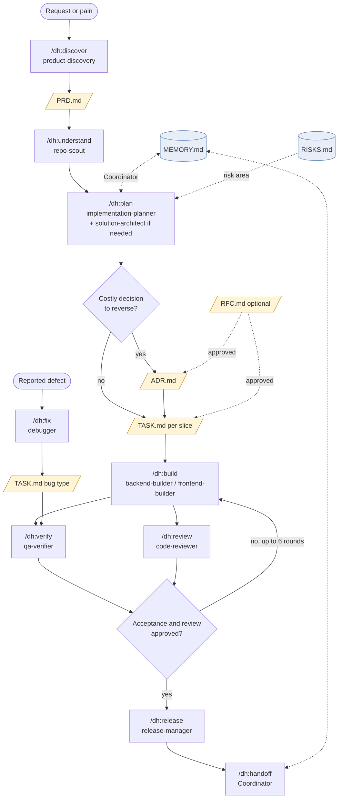
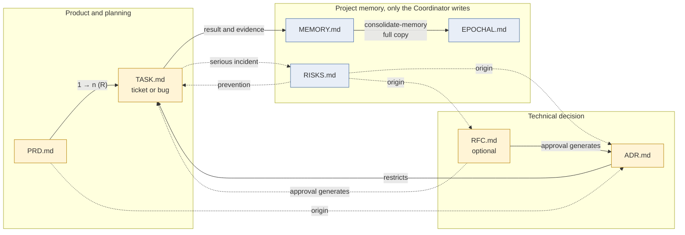

# When to use each template
Versão em pt-br: [docs/tutoriais/templates.md](../../tutoriais/templates.md)

The templates live in `templates/pt-br/` and `templates/en/` in the kit, in mirrored versions; `setup` records `language` in `.harness/project.yaml` and selects the folder. In the consumer project, each one lives in `.harness/`, populated from the copy. This guide explains which one to use, who writes it, and when to open and close it.

## Summary

| Template | Answers | Who writes | Open when | Close when |
|---|---|---|---|---|
| `PRD.md` | Why and what (product) | Product owner, with `product-discovery` | A pain point or opportunity still lacks clear scope and acceptance criteria | Requirements (rules) and acceptance approved; status `delivered on <date>` when the batch closes |
| `TASK.md` (ticket) | How to execute a slice | `implementation-planner`; executed by the builder | The PRD has been approved | Checks passed, review completed, result recorded |
| `TASK.md` (bug) | What fails and why | `debugger` | A defect was reported or observed | Reproduction in Flow and a green regression test in "Done when", or the status is inconclusive with the gap declared |
| `ADR.md` | Which durable decision was made and why | `solution-architect`, approved by the owner | A costly-to-reverse choice needs a record | Status `accepted`; reviewed when the review condition occurs |
| `RFC.md` (optional) | Which technical change is proposed, before building | Engineering | A broad change without a PRD has impact beyond the author | Approved (generates ADR and tickets), rejected, or withdrawn |
| `MEMORY.md` | Current execution state | Coordinator only | During project initialization (`setup`) | Never closes; trimmed by `consolidate-memory` |
| `EPOCHAL.md` | Raw history of previous memories | Coordinator only | During the first `consolidate-memory` | Never closes; only receives batches |
| `RISKS.md` | Serious incidents and prevention | Coordinator only | During project initialization | Never closes; resolved incidents remain |

The PRD passes through `document-validator` before it reaches the owner: the Coordinator runs the write then validate cycle until `approved` or two rounds, and the report lives in `<document>.review.md` next to the PRD. The PRD has four sections (Problem, Solution, Rules, Docs) and an optional appendix for alternatives and risks.

`TASK.md` is the ticket: after the header come Lane, Story, Flow, Rules (a literal copy of the PRD `R<n>` the ticket honors), Docs, Done when, Result, and Risks and limits. The lane is one of `backend`, `frontend`, `dados` (data), `infra`, `teste (unitário)` (unit test), `teste (integração)` (integration test), or `teste (unitário e integração)`, and `/dh:build` routes the ticket by it. A bug ticket has no defect section: the reproduction goes into Flow and the green regression test goes into "Done when". `STORY.md` no longer exists; the story is one sentence inside the ticket.

## Rules that apply to all

- Facts, hypotheses, and decisions are marked as such.
- Paths are relative to the project. No secrets, tokens, or personal paths.
- Each acceptance criterion is "when X, then Y" and points to the scenario or test that proves it.
- Evidence exists only with an explicit state: passed, failed, or not-run. Typechecking does not prove behavior.
- HTML comments in templates are filling guidance and are removed from the final file.
- The three memory records are written only by the Coordinator. All other roles report.

## How to choose

**Does it start with a user or business pain point?** PRD. Each observable requirement becomes a rule `R<n>` and is covered by at least one test-lane ticket (`/dh:plan` requires this). If the scope is already clear and fits in one ticket, skip the PRD and open the ticket with the story and rules written in it.

**Is it a slice of work for an agent to execute?** Ticket (`TASK.md`), with the story in one sentence and the behavior in Flow. If it does not fit in a few observable steps, split it before planning. If it is a defect, use the same file with the reproduction in Flow and the regression test in "Done when".

**Is it a technical choice that is costly to reverse?** ADR. Always include the option to "keep as is" and the review condition.

**Is it a broad technical change without a PRD and with impact beyond the author?** RFC, if you want formal discussion first. In solo development with agents, an ADR with status `proposed` is usually enough; the RFC is optional.

**Is it state, history, or an incident?** None of the above. Report it to the Coordinator, who writes in `MEMORY.md`, `EPOCHAL.md`, or `RISKS.md`.

## Engineering flow

Example using the kit commands. Not every task goes through every stage: a bug goes directly into `fix`; a small edit goes directly into `build` with a task.

The new flow, end to end: the PRD is born in `/dh:discover` and goes through `document-validator` (one validator, up to two rounds) before it reaches the owner. Once approved, `/dh:plan` splits it into tickets by lane, and every observable rule `R<n>` must be cited by a test ticket. `/dh:build` routes each ticket by lane; an implementation ticket goes through `qa-verifier` and one Claude reviewer, and a test ticket only through `qa-verifier`. With every ticket approved, `/dh:review feature PRD-<n>` runs the final feature review, covering integration and adherence to the PRD, and ends in `FEATURE APROVADA`, `FEATURE REPROVADA`, or `FEATURE BLOQUEADA` (approved, rejected, or blocked). When the batch closes, the Coordinator writes the "Resumo executado" (executed summary) section at the end of the PRD and sets the status to `delivered on <date>`. Details: [`docs/en/new-prd-flow.md`](../new-prd-flow.md) and [`docs/prd/PRD-007-fluxo-prd-e-tickets.md`](../../prd/PRD-007-fluxo-prd-e-tickets.md) (pt-br).


```mermaid
flowchart TB
    ideia([Request or pain]) --> discover["/dh:discover<br/>product-discovery"]
    discover --> prd[/PRD.md/]
    prd --> understand["/dh:understand<br/>repo-scout"]
    understand --> plan["/dh:plan<br/>implementation-planner<br/>+ solution-architect if needed"]
    plan --> decisao{Costly decision<br/>to reverse?}
    decisao -->|yes| adr[/ADR.md/]
    decisao -->|no| tasks
    adr --> tasks[/TASK.md per slice/]
    tasks --> build["/dh:build<br/>backend-builder / frontend-builder"]
    build --> verify["/dh:verify<br/>qa-verifier"]
    build --> review["/dh:review<br/>code-reviewer"]
    verify --> ok{Acceptance and review<br/>approved?}
    review --> ok
    ok -->|no, up to 6 rounds| build
    ok -->|yes| release["/dh:release<br/>release-manager"]
    release --> handoff["/dh:handoff<br/>Coordinator"]

    bug([Reported defect]) --> fix["/dh:fix<br/>debugger"]
    fix --> bugtask[/TASK.md bug type/]
    bugtask --> verify

    rfc[/RFC.md optional/] -.->|approved| adr
    rfc -.->|approved| tasks

    memoria[(MEMORY.md)] <-.->|Coordinator| plan
    memoria <-.-> handoff
    risks[(RISKS.md)] -.->|risk area| plan

    classDef doc fill:#fff4d6,stroke:#b8860b
    classDef mem fill:#e8eef7,stroke:#4a6fa5
    class prd,adr,tasks,bugtask,rfc doc
    class memoria,risks mem
```

## Relationship between files


```mermaid
flowchart LR
    subgraph produto[Product and planning]
        PRD[PRD.md] -->|"1 → n (R)"| TASK[TASK.md<br/>ticket or bug]
    end

    subgraph decisao[Technical decision]
        RFC[RFC.md<br/>optional] -->|approval generates| ADR[ADR.md]
        RFC -.->|approval generates| TASK
        ADR -->|restricts| TASK
        PRD -.->|origin| ADR
    end

    subgraph memoria["Project memory, only the Coordinator writes"]
        MEMORY[MEMORY.md] -->|consolidate-memory<br/>full copy| EPOCHAL[EPOCHAL.md]
        RISKS[RISKS.md]
    end

    TASK -->|result and evidence| MEMORY
    TASK -.->|serious incident| RISKS
    RISKS -.->|prevention| TASK
    RISKS -.->|origin| ADR
    RISKS -.->|origin| RFC

    classDef doc fill:#fff4d6,stroke:#b8860b
    classDef mem fill:#e8eef7,stroke:#4a6fa5
    class PRD,TASK,ADR,RFC doc
    class MEMORY,EPOCHAL,RISKS mem
```

Arrow legend: a solid line means derivation or writing; a dotted line means reference or consultation. The cardinalities indicate that one PRD generates multiple tickets (one per requirement, or more than one when a rule needs more than one ticket).

## Suggested locations in the consumer project

```
.harness/
  project.yaml        project profile (setup)
  MEMORY.md           EPOCHAL.md          RISKS.md
  prd/PRD-001.md
  adr/ADR-001.md
  rfc/RFC-001.md      (optional)
  tasks/T-001/TASK.md
  tasks/BUG-001/TASK.md
```

Only `.harness/tasks/<id>/` and the three memory records are defined by the product plan. The other directories are suggested conventions and may change in the project profile.
