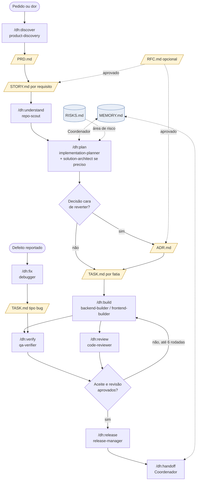
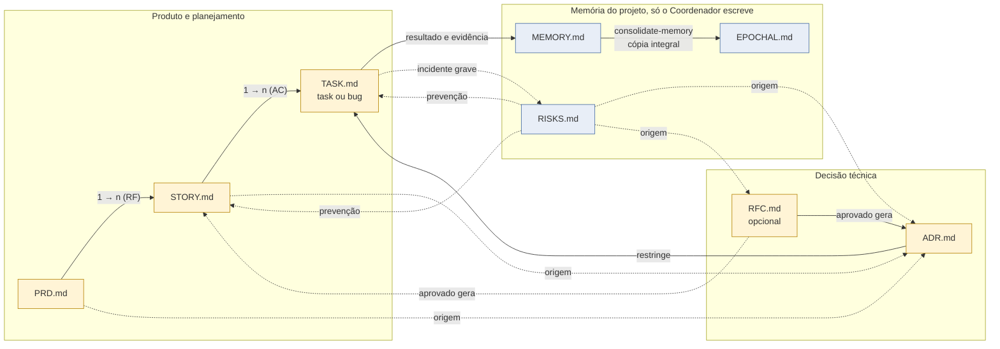

# Quando usar cada template
English version: [docs/en/tutorials/templates.md](../en/tutorials/templates.md)

Os modelos ficam em `templates/pt-br/` e `templates/en/` no kit, em versões espelhadas; o `setup` grava `language` em `.harness/project.yaml` e escolhe a pasta. No projeto consumidor, cada um vive em `.harness/`, preenchido a partir da cópia. Este guia diz qual usar, quem escreve, quando abrir e quando fechar cada um.

## Resumo

| Template | Responde | Quem escreve | Abrir quando | Fechar quando |
|---|---|---|---|---|
| `PRD.md` | Por quê e o quê (produto) | Dono do produto, com `product-discovery` | Uma dor ou oportunidade ainda não tem escopo e aceite claros | Requisitos e aceite aprovados; stories derivadas |
| `STORY.md` | Qual comportamento, de ponta a ponta | `product-discovery` ou `implementation-planner` | Um requisito do PRD precisa virar algo testável | Todos os AC têm evidência de passou |
| `TASK.md` (task) | Como executar uma fatia | `implementation-planner`; executado pelo builder | A story foi decomposta em fatias verificáveis | Checks passaram, revisão feita, resultado preenchido |
| `TASK.md` (bug) | O que falha e por quê | `debugger` | Um defeito foi reportado ou observado | Reprodução antes/depois e regressão registradas, ou status inconclusivo com lacuna declarada |
| `ADR.md` | Qual decisão durável foi tomada e por quê | `solution-architect`, aprovado pelo dono | Uma escolha cara de reverter precisa de registro | Status `aceito`; revisado quando a condição de revisão ocorrer |
| `RFC.md` (opcional) | Qual mudança técnica se propõe, antes de construir | Engenharia | Mudança ampla sem PRD, com impacto além do autor | Aprovado (gera ADR e stories), rejeitado ou retirado |
| `MEMORY.md` | Estado vigente da execução | Só o Coordenador | Na inicialização do projeto (`setup`) | Nunca fecha; é enxugado por `consolidate-memory` |
| `EPOCHAL.md` | Histórico bruto das memórias anteriores | Só o Coordenador | No primeiro `consolidate-memory` | Nunca fecha; só recebe lotes |
| `RISKS.md` | Incidentes graves e prevenção | Só o Coordenador | Na inicialização do projeto | Nunca fecha; incidentes resolvidos permanecem |

O PRD passa pelo `document-validator` antes de chegar ao dono: o Coordenador roda criação → validação até `approved` ou duas rodadas, e o relatório fica em `<documento>.review.md` ao lado do PRD.

## Regras que valem para todos

- Fato, hipótese e decisão ficam marcados como tal.
- Caminhos relativos ao projeto. Sem segredos, tokens ou caminhos pessoais.
- Cada critério de aceite é "quando X, então Y" e aponta o cenário ou teste que o prova.
- Evidência só existe com estado explícito: passou, falhou ou não executado. Typecheck não prova comportamento.
- Comentários HTML nos templates são guia de preenchimento e saem do arquivo final.
- Os três registros de memória são escritos apenas pelo Coordenador. Os demais papéis reportam.

## Como escolher

**Começa por uma dor de usuário ou de negócio?** PRD. Se o escopo já é claro e cabe em uma story, pule o PRD e abra a story apontando a origem.

**É um comportamento entregável e testável?** Story. Se não cabe em poucas tasks, divida antes de planejar.

**É uma fatia de trabalho para um agente executar?** Task. Se é um defeito, o mesmo arquivo com a seção de bug preenchida.

**É uma escolha técnica cara de reverter?** ADR. Inclua sempre a opção "manter como está" e a condição de revisão.

**É uma mudança técnica ampla sem PRD e com impacto além do autor?** RFC, se quiser discussão formal antes. Em desenvolvimento solo com agentes, um ADR com status `proposto` costuma bastar; o RFC é opcional.

**É estado, histórico ou incidente?** Nenhum dos anteriores. Reporte ao Coordenador, que escreve em `MEMORY.md`, `EPOCHAL.md` ou `RISKS.md`.

## Fluxo de engenharia

Exemplo com os comandos do kit. Nem toda tarefa passa por todas as etapas: um bug entra direto em `fix`; uma edição pequena entra direto em `build` com uma task.



## Relação entre os arquivos



Leitura das setas: linha cheia é derivação ou escrita; linha pontilhada é referência ou consulta. Os cardinais indicam que um PRD gera várias stories (uma por requisito) e uma story gera várias tasks (cobrindo seus critérios de aceite).

## Locais sugeridos no projeto consumidor

```
.harness/
  project.yaml        perfil do projeto (setup)
  MEMORY.md           EPOCHAL.md          RISKS.md
  prd/PRD-001.md
  stories/ST-001.md
  adr/ADR-001.md
  rfc/RFC-001.md      (opcional)
  tasks/T-001/TASK.md
  tasks/BUG-001/TASK.md
```

Apenas `.harness/tasks/<id>/` e os três registros de memória são definidos pelo plano do produto. Os demais diretórios são convenção sugerida e podem mudar no perfil do projeto.
