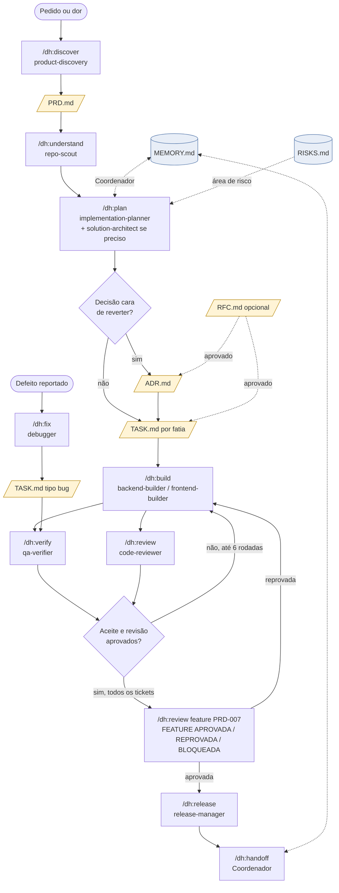
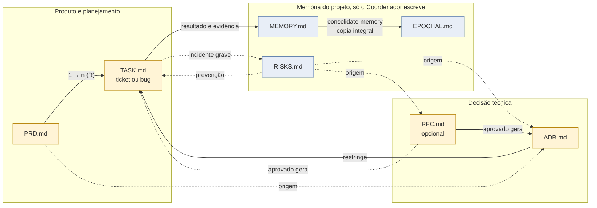

# Quando usar cada template
English version: [docs/en/tutorials/templates.md](../en/tutorials/templates.md)

Os modelos ficam em `templates/pt-br/` e `templates/en/` no kit, em versões espelhadas; o `setup` grava `language` em `.harness/project.yaml` e escolhe a pasta. No projeto consumidor, cada um vive em `.harness/`, preenchido a partir da cópia. Este guia diz qual usar, quem escreve, quando abrir e quando fechar cada um.

## Resumo

| Template | Responde | Quem escreve | Abrir quando | Fechar quando |
|---|---|---|---|---|
| `PRD.md` | Por quê e o quê (produto) | Dono do produto, com `product-discovery` | Uma dor ou oportunidade ainda não tem escopo e aceite claros | Requisitos (regras) e aceite aprovados; status `entregue em <data>` só quando nenhuma regra ficou "Não honrada" sem decisão registrada do dono |
| `TASK.md` (ticket) | Como executar uma fatia | `implementation-planner`; executado pelo builder | O PRD foi aprovado | Checks passaram, revisão feita, resultado preenchido |
| `TASK.md` (bug) | O que falha e por quê | `debugger` | Um defeito foi reportado ou observado | Reprodução no Fluxo e teste de regressão verde no "Pronto quando", ou status inconclusivo com lacuna declarada |
| `ADR.md` | Qual decisão durável foi tomada e por quê | `solution-architect`, aprovado pelo dono | Uma escolha cara de reverter precisa de registro | Status `aceito`; revisado quando a condição de revisão ocorrer |
| `RFC.md` (opcional) | Qual mudança técnica se propõe, antes de construir | Engenharia | Mudança ampla sem PRD, com impacto além do autor | Aprovado (gera ADR e tickets), rejeitado ou retirado |
| `MEMORY.md` | Estado vigente da execução | Só o Coordenador | Na inicialização do projeto (`setup`) | Nunca fecha; é enxugado por `consolidate-memory` |
| `EPOCHAL.md` | Histórico bruto das memórias anteriores | Só o Coordenador | No primeiro `consolidate-memory` | Nunca fecha; só recebe lotes |
| `RISKS.md` | Incidentes graves e prevenção | Só o Coordenador | Na inicialização do projeto | Nunca fecha; incidentes resolvidos permanecem |

O PRD passa pelo `document-validator` antes de chegar ao dono: o Coordenador roda criação → validação até `approved` ou duas rodadas, e o relatório fica em `<documento>.review.md` ao lado do PRD. O PRD tem quatro seções (Problema, Solução, Regras, Docs) e um apêndice opcional para alternativas e riscos.

O `TASK.md` é o ticket: depois do cabeçalho vêm Lane, Story, Fluxo, Regras (cópia literal das `R<n>` do PRD que o ticket honra), Docs, Pronto quando, Resultado e Riscos e limites. A lane é uma destas: `backend`, `frontend`, `dados`, `infra`, `teste (unitário)`, `teste (integração)` ou `teste (unitário e integração)`, e o `/dh:build` roteia o ticket por ela. No ticket de bug não há seção de defeito: a reprodução entra no Fluxo e o teste de regressão verde entra no "Pronto quando". Não existe mais `STORY.md`; a story é uma frase dentro do ticket.

## Regras que valem para todos

- Fato, hipótese e decisão ficam marcados como tal.
- Caminhos relativos ao projeto. Sem segredos, tokens ou caminhos pessoais.
- Cada critério de aceite é "quando X, então Y" e aponta o cenário ou teste que o prova.
- Evidência só existe com estado explícito: passou, falhou ou não executado. Typecheck não prova comportamento.
- Comentários HTML nos templates são guia de preenchimento e saem do arquivo final.
- Os três registros de memória são escritos apenas pelo Coordenador. Os demais papéis reportam.

## Como escolher

**Começa por uma dor de usuário ou de negócio?** PRD. Cada requisito observável vira regra `R<n>` e é coberto por pelo menos um ticket de lane de teste (o `/dh:plan` exige isso). Se o escopo já é claro e cabe em um ticket, pule o PRD e abra o ticket com a story e as regras escritas nele.

**É uma fatia de trabalho para um agente executar?** Ticket (`TASK.md`), com a story em uma frase e o comportamento no Fluxo. Se não cabe em poucos passos observáveis, divida antes de planejar. Se é um defeito, o mesmo arquivo com a reprodução no Fluxo e o teste de regressão no "Pronto quando".

**É uma escolha técnica cara de reverter?** ADR. Inclua sempre a opção "manter como está" e a condição de revisão.

**É uma mudança técnica ampla sem PRD e com impacto além do autor?** RFC, se quiser discussão formal antes. Em desenvolvimento solo com agentes, um ADR com status `proposto` costuma bastar; o RFC é opcional.

**É estado, histórico ou incidente?** Nenhum dos anteriores. Reporte ao Coordenador, que escreve em `MEMORY.md`, `EPOCHAL.md` ou `RISKS.md`.

## Fluxo de engenharia

Exemplo com os comandos do kit. Nem toda tarefa passa por todas as etapas: um bug entra direto em `fix`; uma edição pequena entra direto em `build` com uma task.

Fluxo novo, de ponta a ponta: o PRD nasce no `/dh:discover` e passa pelo `document-validator` (um validador, até duas rodadas) antes de chegar ao dono. Aprovado, o `/dh:plan` o quebra em tickets por lane, e cada regra observável `R<n>` precisa ser citada por um ticket de teste. O `/dh:build` roteia cada ticket pela lane; o ticket de implementação passa por `qa-verifier` e um revisor Claude, e o de teste só por `qa-verifier`. Com todos aprovados, `/dh:review feature PRD-<n>` faz a revisão final da feature, com integração e aderência ao PRD, e termina em `FEATURE APROVADA`, `FEATURE REPROVADA` ou `FEATURE BLOQUEADA`. Ao fechar o lote, o Coordenador escreve a seção "Resumo executado" no fim do PRD e muda o status para `entregue em <data>`, mas só se nenhuma regra `R<n>` ficou "Não honrada" sem uma decisão registrada do dono; caso contrário o PRD não é marcado como entregue. Detalhes: [`docs/novo-fluxo-prd.md`](../novo-fluxo-prd.md) e [`docs/prd/PRD-007-fluxo-prd-e-tickets.md`](../prd/PRD-007-fluxo-prd-e-tickets.md).


```mermaid
flowchart TB
    ideia([Pedido ou dor]) --> discover["/dh:discover<br/>product-discovery"]
    discover --> prd[/PRD.md/]
    prd --> understand["/dh:understand<br/>repo-scout"]
    understand --> plan["/dh:plan<br/>implementation-planner<br/>+ solution-architect se preciso"]
    plan --> decisao{Decisão cara<br/>de reverter?}
    decisao -->|sim| adr[/ADR.md/]
    decisao -->|não| tasks
    adr --> tasks[/TASK.md por fatia/]
    tasks --> build["/dh:build<br/>backend-builder / frontend-builder"]
    build --> verify["/dh:verify<br/>qa-verifier"]
    build --> review["/dh:review<br/>code-reviewer"]
    verify --> ok{Aceite e revisão<br/>aprovados?}
    review --> ok
    ok -->|não, até 6 rodadas| build
    ok -->|sim, todos os tickets| final["/dh:review feature PRD-007<br/>FEATURE APROVADA / REPROVADA / BLOQUEADA"]
    final -->|aprovada| release["/dh:release<br/>release-manager"]
    final -->|reprovada| build
    release --> handoff["/dh:handoff<br/>Coordenador"]

    bug([Defeito reportado]) --> fix["/dh:fix<br/>debugger"]
    fix --> bugtask[/TASK.md tipo bug/]
    bugtask --> verify

    rfc[/RFC.md opcional/] -.->|aprovado| adr
    rfc -.->|aprovado| tasks

    memoria[(MEMORY.md)] <-.->|Coordenador| plan
    memoria <-.-> handoff
    risks[(RISKS.md)] -.->|área de risco| plan

    classDef doc fill:#fff4d6,stroke:#b8860b
    classDef mem fill:#e8eef7,stroke:#4a6fa5
    class prd,adr,tasks,bugtask,rfc doc
    class memoria,risks mem
```

## Relação entre os arquivos


```mermaid
flowchart LR
    subgraph produto[Produto e planejamento]
        PRD[PRD.md] -->|"1 → n (R)"| TASK[TASK.md<br/>ticket ou bug]
    end

    subgraph decisao[Decisão técnica]
        RFC[RFC.md<br/>opcional] -->|aprovado gera| ADR[ADR.md]
        RFC -.->|aprovado gera| TASK
        ADR -->|restringe| TASK
        PRD -.->|origem| ADR
    end

    subgraph memoria["Memória do projeto, só o Coordenador escreve"]
        MEMORY[MEMORY.md] -->|consolidate-memory<br/>cópia integral| EPOCHAL[EPOCHAL.md]
        RISKS[RISKS.md]
    end

    TASK -->|resultado e evidência| MEMORY
    TASK -.->|incidente grave| RISKS
    RISKS -.->|prevenção| TASK
    RISKS -.->|origem| ADR
    RISKS -.->|origem| RFC

    classDef doc fill:#fff4d6,stroke:#b8860b
    classDef mem fill:#e8eef7,stroke:#4a6fa5
    class PRD,TASK,ADR,RFC doc
    class MEMORY,EPOCHAL,RISKS mem
```

Leitura das setas: linha cheia é derivação ou escrita; linha pontilhada é referência ou consulta. Os cardinais indicam que um PRD gera vários tickets (um por requisito, ou mais de um quando uma regra precisa de mais de um ticket).

## Locais sugeridos no projeto consumidor

```
.harness/
  project.yaml        perfil do projeto (setup)
  MEMORY.md           EPOCHAL.md          RISKS.md
  prd/PRD-001.md
  adr/ADR-001.md
  rfc/RFC-001.md      (opcional)
  tasks/T-001/TASK.md
  tasks/BUG-001/TASK.md
```

Apenas `.harness/tasks/<id>/` e os três registros de memória são definidos pelo plano do produto. Os demais diretórios são convenção sugerida e podem mudar no perfil do projeto.
